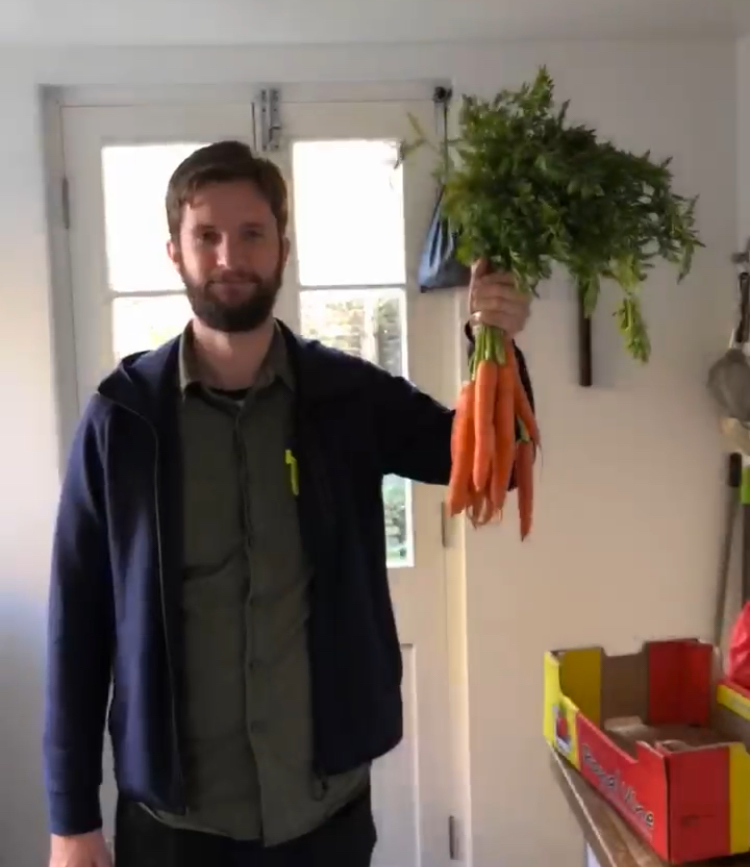

## About me
**Royal Historical Society Centenary Fellow (2019-20) based at the Institute for Historical Research and the Centre for Medieval and Early Modern Studies at the University of Kent.**

I am a CHASE funded doctoral candidate based at the Centre for Medieval and Early Modern Studies (MEMS) at the University of Kent. After ten years as a painter and decorator I began my studies at the Open University before completing a BA in History at Kent. Subsequently I found my home during an MA at MEMS where I was granted a CHASE AHRC doctoral studentship in 2016.

As part of my CHASE studentship I completed a two-month funded placement at the National Archives using subpoena writs to accurately date over six hundred cases from the Court of Chancery in the late fifteenth century. I also work with ‘Up on the Downs’, a landscape-based Heritage Lottery Funded project based in the Dover District Area which is exploring how to engage the public with medieval heritage in the Dover area. 

My thesis is an investigation of corruption and anti-corruption processes within the development of English government institutions from 1307 to 1348. This work looks at the negotiation of centralised and devolved authority and how this authority, when subverted by corrupt actors, affected the crown and its subjects. The thesis includes a database of over 2000 individual cases of wrongdoing collated from anti-corruption investigations carried out in the first half of the fourteenth century. Jack utilises data science methodologies to collect, analyse, and visualise networks of officials and their patrons. I am interested in corruption, digital approaches to the study of the medieval period, Irish history, North Sea Trade, and cricket. 

An academic C.V. is available in PDF form [here](Jack_Newman_CV.pdf). Up to date as of September 2020.

## About this Site
This site is written in markdown using [RStudio](https://rstudio.com/), the [blogdown package](https://bookdown.org/yihui/blogdown/), and [Hugo](https://gohugo.io/). The content is pushed to [Github](https://github.com/) and hosted by [Netlify](https://www.netlify.com/). If you are interested in using a similar approach I used a combination of various tutorials, easily discoverable through a simple search, and parts of this [Youtuber's guides](https://www.youtube.com/playlist?list=PL-Kz5P-mYdMgAJDmRJquyMHfdaIOD-3oj) which were very helpful.

